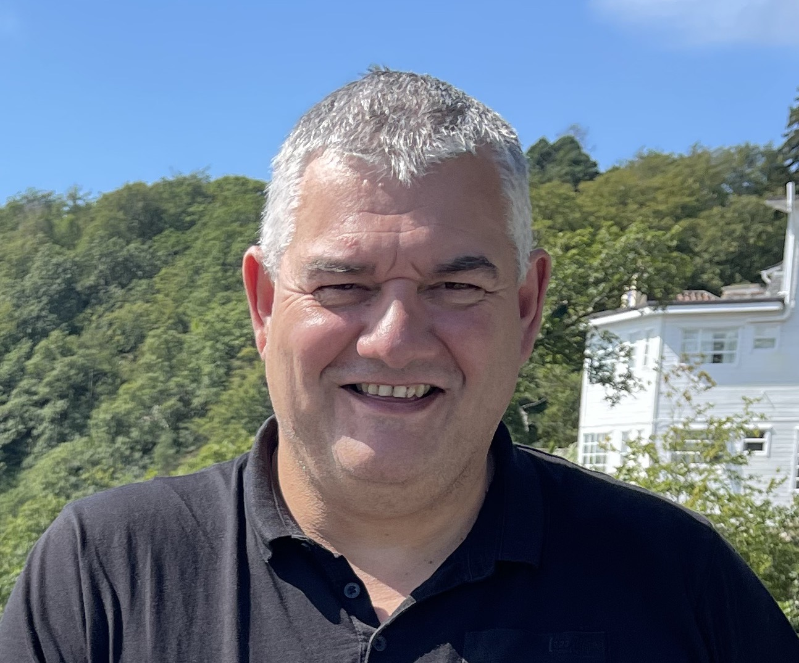

<!-- TOP OF THE PAGE LINK -->

<!-- MAIN HEADER -->
<h1 align="center">
  Welcome to my GitHub page 👋
</h1>

<!-- TABLE OF CONTENTS -->

  
Table of Contents

  <ul>
    <li><a href="#about-me">About Me</a></li>
    <li><a href="#find-me">Find Me</a></li>
    <li><a href="#links">Links</a></li>
  </ol>

<!-- ABOUT ME -->
## About Me

<picture>
  <source media="(prefers-color-scheme: dark)" srcset="profile-image.jpeg">
  <source media="(prefers-color-scheme: light)" srcset="profile-image.jpeg">
  
</picture>

(<a href="#top">back to top</a>)

#### I'm Dimitris, a full stack web developer.
  
💻 Computers were always my passion. I remember myself when I was at school trying to find some time to escape to the only one computer room we had so I could stay in front of a blank screen and watching, as I couldn't do anything else (lack of knowledge 😢).

👨‍🎓 I did my first computer training in 1990 at Omega College, a Greek college in the heart of Athens. Since then I have had many online and classroom courses. I started with some (now obsolete) languages like Cobol, Pascal and Basic. When the Internet became popular, my interest in creating websites was so strong that I could not resist entering this world.

🌱  My passion for knowledge and development led me to even more courses. Right now as I write I'm improving/expanding my knowledge with the following:

 

* 
* 
* 
* 
* 
* 

 

🇬🇷 I am originally from Greece but I live in 🇬🇧 UK since 2004. I have British citizenship with a British passport and full rights to live and work in UK.

🥅 My goal is to be able to work as a Web Developer so that I can turn my passion into energy as it is impossible for me to see it as a mandatory job. So if this sounds interesting to you please do not hesitate to contact me.

(<a href="#top">back to top</a>)

<!-- FIND ME -->
## Links

[🖇️ My CV](https://github.com/Aeolos71/Aeolos71/blob/main/web-dev-CV.pdf)

[🌍 aeolos.co.uk](https://aeolos.co.uk)

[📧 dimitriou.uk@gmail.com](mailto:dimitriou.uk@gmail.com)

(<a href="#top">back to top</a>)

